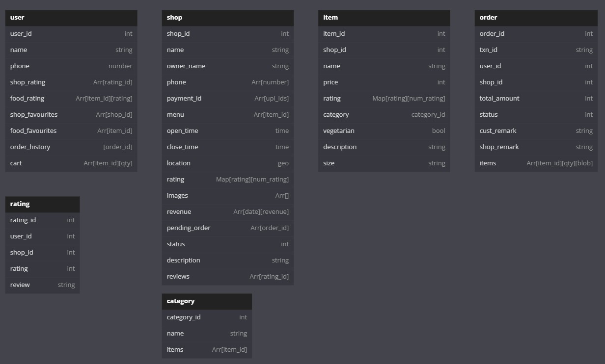

# Kriti Software Development PS

## Explore IITG

## How to run
- Install the .apk file uploaded in the drive link submitter and run on an android device
- Alternatively, you can build your own release by cloning the github repo, and running 
```
flutter build apk --release
```
- Make sure you have Flutter SDK and Android Studio installed

## Pages

#### <ul>
- Onboarding Screen
- Login & Signup Screens
- shopkeeper side
  - Home page
  - Edit Menu page
  - Orders page
- user side
  - Home page
  - Search Result page
  - Shop Info Page
  - Cart page
</ul>

## TechStack Used
##### <ul><li>Frontend: Flutter</li><li>Backend: Firebase</li></ul>

# App over website
- Looking at the feasibility of the problem, most of the people use mobile apps over websites for food ordering apps
- We choose dart/flutter over Kotlin as it is cross platform language/framework, so our app can have same codebase but can run over both iOS as well as android

## How to Contribute

1. Clone repo and create a new branch: `$ git checkout https://github.com/TESLA2402/Manas_Kriti_Software_PS -b name_for_new_branch`.
2. Make changes and test
3. Submit Pull Request with comprehensive description of changes


# Problem Statement
Here is the [Problem Statement](https://drive.google.com/file/d/16wdqckUTX7sdWBdRMXl4wTQ4Va3z_PqZ/view?usp=sharing)

# Database Design


# Design Figma Link
Here is the [Figma link](https://www.figma.com/file/o0DM8QUvXXjSW8mszgayDA/Kriti-YO-Manas!?node-id=0%3A1&t=VngK01yZM4kRlAaY-1)

# Drive Link
Here is the [Drive link](https://drive.google.com/drive/folders/13RyhSZ6pYDM1VEJlHYRkSBidqHLEkXYB?usp=share_link)
```
Submitted by:
MANAS HOSTEL
```
